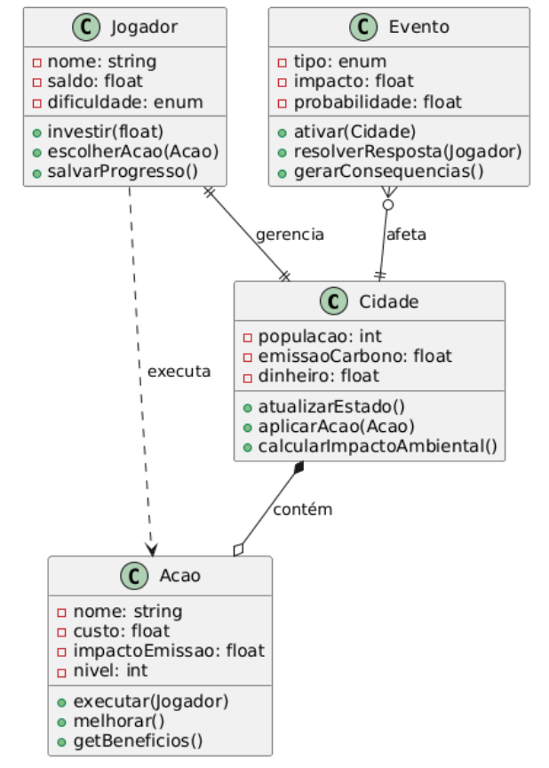
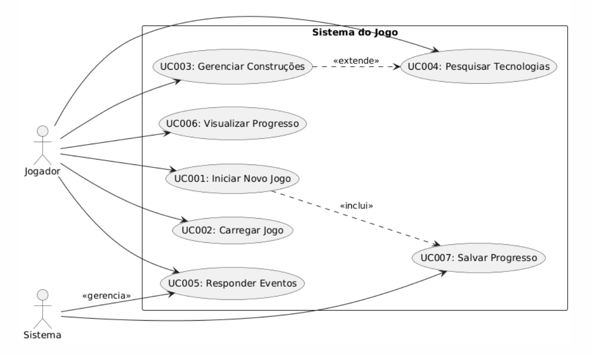

# Diagramas de Classes e Casos de Uso

## Diagrama de Classes
O Diagrama de Classes representa as principais entidades do sistema, suas atributos e métodos. Ele modela a estrutura estática do jogo, focando em classes centrais como Cidade, Acao, Jogador e Evento. As relações incluem herança, composição e associações (ex.: um Jogador gerencia uma Cidade).

### Representação Textual (Notação UML Simplificada)
- **Classe Cidade**
  - Atributos: população (int), emissãoCarbono (float), dinheiro (float)
  - Métodos: atualizarEstado(), aplicarAcao(Acao acao), calcularImpactoAmbiental()
  - Relações: Composição com múltiplas Acoes; Associação com Jogador (1:1)

- **Classe Acao** (abstrata, para infraestruturas verdes e pesquisas)
  - Atributos: nome (string), custo (float), impactoEmissao (float), nivel (int)
  - Métodos: executar(Jogador jogador), melhorar(), getBeneficios()
  - Relações: Herança para subclasses como InfraestruturaVerde e TecnologiaLimpa; Associação com Cidade (muitos para um)

- **Classe Jogador**
  - Atributos: nome (string), saldo (float), dificuldade (enum: Facil, Medio, Dificil)
  - Métodos: investir(float valor), escolherAcao(Acao acao), salvarProgresso()
  - Relações: Associação com Cidade (1:1); Agregação com múltiplas Acoes

- **Classe Evento**
  - Atributos: tipo (enum: Seca, Inundacao, OndaCalor), impacto (float), probabilidade (float)
  - Métodos: ativar(Cidade cidade), resolverResposta(Jogador resposta), gerarConsequencias()
  - Relações: Associação com Cidade (muitos para um); Dependência do Sistema para geração aleatória

### Relações entre Classes
- Jogador **gerencia** Cidade (associação).
- Cidade **contém** múltiplas Acoes (composição).
- Evento **afeta** Cidade (associação).
- Acao é **executada por** Jogador (dependência).

## Diagrama de Casos de Uso
O Diagrama de Casos de Uso foca nos atores (Jogador e Sistema) e nos fluxos de interação principais, baseados nos Requisitos Funcionais (RFs). Ele mostra o que o sistema faz do ponto de vista do usuário, sem detalhes de implementação.

### Atores
- **Jogador**: Usuário principal que interage com o jogo (inicia partidas, constrói, responde eventos).
- **Sistema**: Entidade automática que gerencia simulações, saves e eventos aleatórios.

### Casos de Uso Principais (baseados nos RFs)
- **UC001: Iniciar Novo Jogo** (RF001, RF002) – Jogador cria uma nova cidade e define parâmetros.
- **UC002: Carregar Jogo Existente** (RF003) – Jogador seleciona e carrega um save.
- **UC003: Gerenciar Recursos e Construções** (RF005, RF006) – Jogador visualiza e constrói infraestruturas verdes.
- **UC004: Pesquisar Tecnologias** (RF007) – Jogador investe em tecnologias limpas.
- **UC005: Responder Eventos Climáticos** (RF008) – Jogador reage a eventos gerados pelo Sistema.
- **UC006: Visualizar Progresso e Conquistas** (RF009, RF010) – Jogador acessa estatísticas e achievements.
- **UC007: Salvar Progresso** (RF004) – Sistema salva automaticamente; Jogador salva manualmente.

### Relações
- **Inclui**: UC001 inclui UC007 (salvamento inicial).
- **Extende**: UC003 estende UC004 (pesquisa pode ser necessária para construções avançadas).
- **Gera**: Sistema <<gerencia>> UC005 (eventos aleatórios).

### Representação Textual (Notação UML Simplificada)
- Atores: Jogador (esquerda), Sistema (direita).
- Use Cases em elipses: Conectados por linhas a atores.
  - Jogador --> UC001, UC002, UC003, UC004, UC005, UC006.
  - Sistema --> UC007 (salvamento auto), UC005 (geração de eventos).

